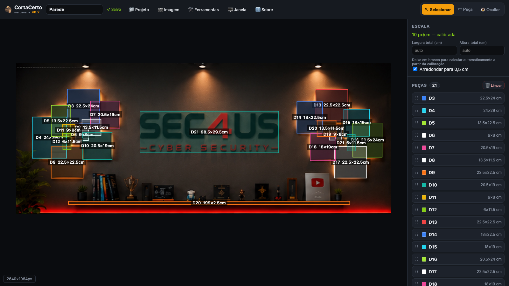
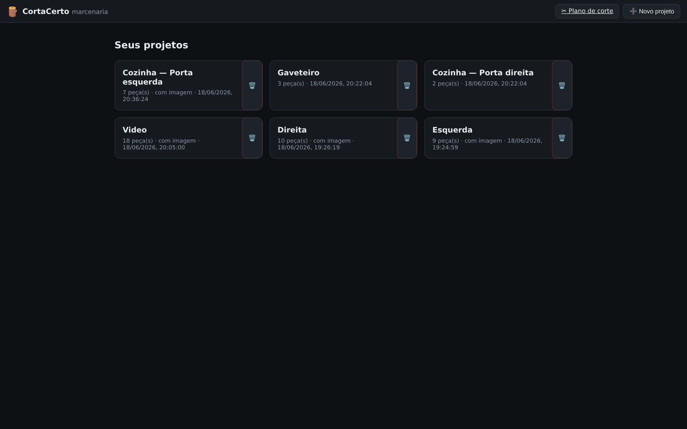
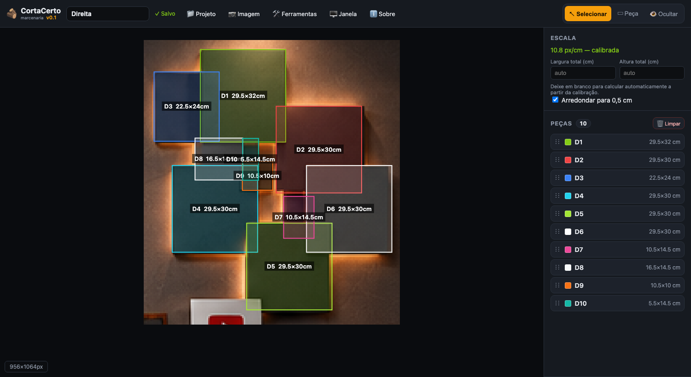
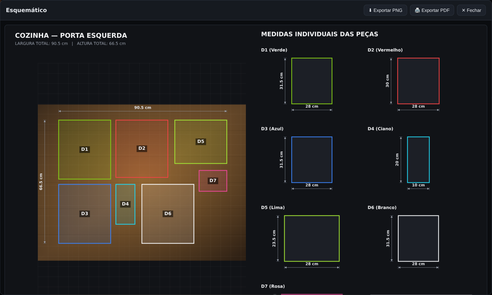
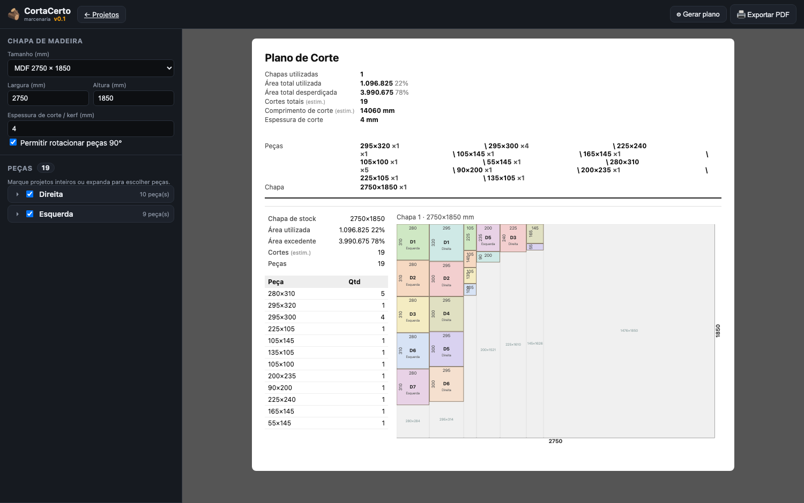

# 🪵 CortaCerto



**CortaCerto** é um web app **auto-hospedado** (Docker) para marcenaria: você mapeia
o tamanho das peças sobre uma **foto de referência**, organiza tudo em **projetos**
salvos localmente e gera um **plano de corte otimizado** das chapas de madeira —
minimizando desperdício e com cortes guilhotinados válidos para seccionadora.

Tudo roda na sua máquina. O editor é HTML/CSS/JS puro no navegador; um pequeno
servidor Node (sem dependências externas) serve o app e grava os projetos em
arquivos JSON num diretório local (`./data`). Nenhum dado sai do seu computador.

---

## 📸 Telas

### Lista de projetos


### Editor — peças sobre a foto de referência


### Esquemático com as medidas


### Plano de corte otimizado


---

## ✨ Funcionalidades

### Barra de menus
Toda a navegação fica numa **barra de menus** estilo desktop, presente na lista de
projetos (com os itens não aplicáveis desativados) e no editor:

- **📁 Projeto** — Novo projeto, Abrir…, Abrir recente, Duplicar, Exportar, Nova
  janela, Fechar.
- **📷 Imagem** — Carregar/Nova imagem, Recortar, Calibrar.
- **🛠 Ferramentas** — Otimizar, Esquemático, Plano de corte.
- **🖥️ Janela** — Zoom 100%, Preencher, Centralizar.
- **ℹ️ Sobre** — informações e versão do app.

Os atalhos de teclado aparecem à direita de cada item e se adaptam ao sistema
(`⌥⌘…` no macOS, `Ctrl+Alt+…` no Windows/Linux). Todos os diálogos (avisos,
confirmações, entradas de texto) são **modais customizados** — nada do navegador.

### Projetos
- 📁 **Vários projetos**, cada um com URL própria por UUID (`/p/<uuid>`).
- 💾 **Auto-save** no servidor a cada alteração (gravado em `./data/<uuid>.json`).
- ⧉ **Duplicar** o projeto atual (com um novo nome).
- ⬇ **Exportar / 📂 Abrir** projeto em `.json` (backup, com a imagem embutida).

### Editor de peças
- 📷 Carregar uma **imagem de fundo** (foto do painel/móvel) pelo menu **Imagem**.
- 📏 **Calibrar a escala**: arraste sobre uma medida conhecida e informe os cm — o
  app converte px → cm automaticamente.
- ✂ **Recortar (crop)** a imagem (peças e calibração são reposicionadas sozinhas).
- ▭ **Desenhar peças** como retângulos: mover, redimensionar (8 alças), nomear e
  colorir. A ferramenta "Peça" permanece ativa para desenhar várias em sequência.
- 🎨 Cada peça tem rótulo (D1, D2…), nome da cor, cor da borda e medidas (auto ou
  manuais).
- 👁 **Ocultar/mostrar** as peças sobre o desenho a qualquer momento.
- ↕ **Reordenar peças** por **arrastar e soltar** (também controla a sobreposição).
- ⬍ Botões de **camada** (frente/trás) e 📐 **arredondar para 0,5 cm**.
- ✨ **Otimizar**: analisa as medidas de todas as peças e **iguala valores
  próximos** (dentro de uma tolerância) para reaproveitar melhor a chapa.
- 🗑 **Limpar**: excluir todas as peças de uma vez.

### Saídas
- 📐 **Esquemático** (menu Ferramentas) com cotas totais + medidas individuais;
  exporta **PNG** e **PDF** (fundo branco, foto a 50% para economizar tinta).
- ✂ **Plano de corte** (menu Ferramentas): escolha o tamanho da chapa, a espessura
  de corte (kerf) e selecione projetos inteiros **ou peças individuais de vários
  projetos**. O app empacota as peças em colunas, mostra o aproveitamento e
  exporta **PDF**.

---

## 🚀 Instalação

### Pré-requisitos
- **Docker** e **Docker Compose** instalados.

### Passo a passo

1. **Obtenha o código** (clone ou cópia da pasta):
   ```bash
   git clone https://github.com/helviojunior/corta-certo.git
   cd corta-certo
   ```

2. **Suba o container** (build + execução em segundo plano):
   ```bash
   docker compose up -d --build
   ```

3. **Acesse no navegador:**
   👉 **http://localhost:8080**

4. **Pronto.** Os projetos ficam salvos na pasta **`./data`** (criada
   automaticamente e montada como volume). Faça backup dessa pasta para preservar
   seu trabalho.

### Comandos úteis

```bash
docker compose logs -f      # acompanhar os logs
docker compose restart      # reiniciar
docker compose down         # parar e remover o container (os dados em ./data ficam)
docker compose up -d --build  # aplicar atualizações do código
```

### Mudar a porta
Defina `HOST_PORT` no `.env` (copie de `.env.example`) e rode `docker compose up -d`:

```env
HOST_PORT=9000
```

O padrão é `8080`.

### Modo online / público (`ONLINE_MODE`)
Para hospedar uma instância pública/compartilhada, ative o **modo online** via variável
de ambiente. Copie `.env.example` para `.env` e defina:

```env
ONLINE_MODE=1
```

Com `ONLINE_MODE=1`:
- Cada visitante recebe um **cookie de sessão**; a lista mostra **apenas os projetos
  do dono do cookie**, e **editar/excluir exige ser o dono**.
- **Visualizar por link** (`/p/<id>`) continua **aberto** — os projetos são **públicos**:
  qualquer pessoa com o link pode vê-los.
- O app exibe avisos de que os projetos são **temporários** (recomenda-se exportar) e
  **visíveis publicamente** (na tela inicial, na instrução do editor e na página **Sobre**).

No modo padrão (`ONLINE_MODE=0`, auto-hospedado) não há cookies nem filtragem: todos os
projetos aparecem na lista.

### Sem Docker (desenvolvimento)
Requer Node 18+:
```bash
node server.js          # serve em http://localhost:80
PORT=8080 node server.js  # ou em outra porta
```

---

## 🧭 Como usar

### 1) Criar/abrir um projeto
- Na tela inicial (**/**) clique em **➕ Novo projeto** (ou **📁 Projeto → Novo
  projeto**) e dê um nome.
- A lista mostra todos os projetos (nº de peças, data); clique para abrir ou use
  🗑 para excluir. **📁 Projeto → Abrir recente** lista os últimos projetos.

### 2) Mapear as peças (editor)
1. **📷 Imagem → Carregar imagem** → carregue a foto do painel (ou arraste/cole a
   imagem na área de desenho).
2. **📷 Imagem → Calibrar** → arraste sobre algo de tamanho conhecido (régua, uma
   medida que você já sabe) e digite o valor em cm.
3. **▭ Peça** (paleta de ferramentas) → arraste para criar cada retângulo. Ajuste
   pela barra lateral (rótulo, cor, posição). As medidas em cm aparecem sozinhas.
   - Marque **Medida manual** para digitar a largura/altura exatas.
4. (Opcional) **🛠 Ferramentas → Otimizar** → informe a tolerância (ex.: `1` cm)
   para igualar medidas próximas e facilitar o corte.
5. Tudo é salvo automaticamente (**✓ Salvo** no topo).

### 3) Gerar o esquemático
- **🛠 Ferramentas → Esquemático** → confira o desenho com as cotas e exporte em
  **PNG** ou **🖨 PDF** (otimizado para impressão).

### 4) Gerar o plano de corte
1. Abra **🛠 Ferramentas → Plano de corte** (ou acesse **/corte**).
2. Defina o **tamanho da chapa** (presets ou personalizado, em mm) e a
   **espessura de corte / kerf** (ex.: `4` mm).
3. Marque **projetos inteiros** ou expanda e selecione **peças individuais** de
   vários projetos.
4. **⚙ Gerar plano** → veja o aproveitamento por chapa e **🖨 Exportar PDF**.

> Dica: rode **🛠 Ferramentas → Otimizar** nos projetos antes — peças com a mesma
> largura formam colunas cheias e desperdiçam menos chapa.

### Atalhos de teclado (editor)

Ferramentas de desenho (tecla única):

| Tecla | Ação |
|-------|------|
| `V` | Ferramenta selecionar |
| `R` | Desenhar peça |
| `C` | Calibrar |
| `X` | Recortar imagem (Enter aplica, Esc cancela) |
| `Delete` / `Backspace` | Excluir peça selecionada |
| Setas | Mover peça (Shift = 10px) |
| `Esc` | Desmarcar |
| Roda do mouse | Zoom |
| Botão do meio / `Espaço`+arrastar | Mover a tela (pan) |

Menus (`⌥⌘` no macOS · `Ctrl+Alt` no Windows/Linux):

| Atalho | Ação |
|--------|------|
| `⌥⌘N` | Novo projeto |
| `⌥⌘O` | Abrir projeto (.json) |
| `⌥⌘D` | Duplicar projeto |
| `⌥⌘S` | Exportar projeto (.json) |
| `⌥⌘W` | Nova janela |
| `⌥⌘F` | Fechar (voltar à lista) |
| `⌥⌘T` | Otimizar medidas |
| `⌥⌘E` | Esquemático |
| `⌥⌘P` | Plano de corte |
| `⌥⌘Z` / `⌥⌘0` / `⌥⌘G` | Zoom 100% / Preencher / Centralizar |

---

## 🗂️ Dados e API

Os projetos são gravados em `./data/<uuid>.json`. O servidor expõe uma API REST:

| Método | Rota | Descrição |
|--------|------|-----------|
| `GET`  | `/api/projects` | Lista os projetos |
| `POST` | `/api/projects` | Cria um projeto (gera UUID) |
| `GET`  | `/api/projects/:id` | Lê um projeto |
| `PUT`  | `/api/projects/:id` | Salva um projeto |
| `DELETE` | `/api/projects/:id` | Exclui um projeto |
| `GET`  | `/api/projects/:id/pieces` | Peças com medidas em mm (sem a imagem) |

### Formato do projeto (`data`)

```jsonc
{
  "version": 1,
  "image": { "dataUrl": "data:image/...", "name": "foto.jpg", "width": 1200, "height": 1100 },
  "scale": { "pxPerCm": 12.4, "refLine": { "x1": 0, "y1": 0, "x2": 0, "y2": 0, "cm": 30 } },
  "total": { "widthCm": 80, "heightCm": 110 },
  "options": { "snapHalf": true },
  "pieces": [
    { "id": 1, "label": "D1", "colorName": "Verde", "color": "#84cc16",
      "x": 120, "y": 80, "w": 300, "h": 350,
      "manual": false, "realW": null, "realH": null }
  ]
}
```

As coordenadas `x,y,w,h` das peças estão em **pixels da imagem original**, então o
projeto é independente do zoom/tamanho da tela.

---

## 📝 Notas

- O número de cortes e o comprimento de corte no plano são **estimativas**.
- O empacotamento é uma heurística (colunas guilhotinadas) — bom aproveitamento e
  cortes válidos para seccionadora, mas não garante o ótimo absoluto.

---

## ⚠️ Escopo e aviso

O **CortaCerto** **não pretende ser um software de design ou uma ferramenta
profissional** de marcenaria. Ele nasceu para **bricolagem / DIY** — uso doméstico
e amador — priorizando simplicidade e rapidez em vez de precisão milimétrica ou
recursos de CAD/CAM.

Por isso, trabalhe com uma **tolerância maior**:

- As medidas vêm de uma **foto calibrada manualmente**, então têm imprecisão natural —
  confira sempre com uma trena antes de cortar.
- O plano de corte e as estimativas (cortes, aproveitamento, comprimento) são
  **aproximações** para planejar e estimar material, não um roteiro exato de produção.
- **Sempre revise o resultado** e adicione folgas/sobras à sua compra. Para projetos
  críticos, profissionais ou em escala, use ferramentas dedicadas de CAD/nesting.

Em resumo: é um **ajudante de fim de semana** para quem curte fazer móveis em casa. 🪵
